# Low-Cost PPG-to-ECG Reconstruction System

## Documentation Repository

This repository documents an ongoing proprietary healthtech research project focused on reconstructing ECG-like waveforms from PPG signals using a low-cost wearable device and a Temporal Convolutional Network based deep learning pipeline.

The project explores whether continuous PPG signals collected from a low-cost wearable-style device can be transformed into ECG-like waveform representations using deep learning.

> **Important:** This is a documentation-only public portfolio repository. Source code, firmware, trained model weights, datasets, raw biosignal recordings, participant data, and proprietary implementation details are intentionally excluded due to intellectual property and startup confidentiality considerations.

> **Medical Disclaimer:** This project is a research prototype. It is not intended for medical diagnosis, emergency monitoring, clinical decision-making, or replacement of directly measured ECG.

---

## Project Summary

Electrocardiogram (ECG) is one of the most informative physiological signals for cardiac assessment. However, continuous ECG acquisition is less practical for everyday wearable monitoring because it usually requires electrodes, dedicated hardware, controlled placement, and more clinical recording conditions.

Photoplethysmography (PPG), on the other hand, is low-cost, non-invasive, and commonly available in wearable optical sensors such as smartwatches, fitness bands, pulse oximeters, and low-cost sensor modules.

This project investigates whether a deep learning model can learn the relationship between PPG and ECG and reconstruct an ECG-like waveform from PPG input.

The work combines:

* Benchmark paired PPG-ECG datasets
* A low-cost wearable-style PPG acquisition prototype
* Signal preprocessing and multichannel input construction
* A Temporal Convolutional Network encoder-decoder model
* ECG-like waveform reconstruction
* Benchmark evaluation
* Custom-device transfer testing
* BPM comparison
* Warning-oriented interpretation
* A web-based visualization interface

---

## Current Project Status

This project is ongoing.

### Completed

* Literature review on PPG-to-ECG reconstruction
* Benchmark dataset preparation
* TCN encoder-decoder reconstruction pipeline
* Multichannel PPG input representation using:

  * PPG
  * dPPG
  * ddPPG
* Low-cost PPG acquisition prototype using MAX30102 and ESP32
* Custom PPG recording workflow
* Benchmark reconstruction experiments
* Custom-device transfer observation
* Mitigated ambient environmental noise and raw signal drift through physical hardware stabilization and signal-level AC-DC extraction optimization.
* BPM comparison workflow
* Web-based visualization/demo interface
* Project documentation and public-safe result summaries

### Ongoing / Future Work

* Collect simultaneous custom PPG and ECG recordings
* Perform device-specific fine-tuning
* Improve acquisition stability
* Validate on more subjects
* Use subject-wise evaluation splits
* Add signal-quality estimation
* Improve real-time deployment workflow
* Conduct clinical-grade validation before any medical use

---

## Research Question

The main research question is:

> Can a low-cost wearable PPG device, combined with a deep learning reconstruction model, generate ECG-like waveforms that preserve useful rhythm information and support accessible cardiac monitoring research?

The project does **not** claim that the reconstructed waveform is clinically equivalent to directly measured ECG. The current focus is research feasibility, signal reconstruction, and prototype-level demonstration.

---

## Motivation

Continuous heart monitoring is important for early awareness, long-term physiological assessment, and accessible health technology. However, direct ECG monitoring is not always convenient for daily use.

PPG is easier to acquire continuously, but it lacks the detailed electrical information of ECG.

This project is motivated by the possibility of combining:

```text
Low-cost PPG sensing + Deep learning reconstruction = More accessible cardiac monitoring research
```

The key idea is not to replace clinical ECG, but to explore whether wearable-friendly PPG can be transformed into a richer ECG-like representation for research and warning-oriented monitoring.

---

## Core Idea

Both ECG and PPG are connected to the cardiac cycle.

* ECG reflects the electrical activity of the heart.
* PPG reflects the peripheral blood-volume response after cardiac contraction.

Although they are not identical, they are physiologically related. A deep learning model may learn this relationship and estimate an ECG-like waveform from PPG.

The reconstruction pipeline uses PPG and its derivatives as input:

```text
PPG → dPPG → ddPPG → TCN Encoder-Decoder → ECG-like waveform
```

The derivative channels help the model observe slope, curvature, and pulse-shape dynamics that may not be obvious from raw PPG alone.

---

## System Architecture

```mermaid
flowchart LR
    A[MAX30102 PPG Sensor] --> B[ESP32 Microcontroller]
    B --> C[Continuous PPG Acquisition]
    C --> D[Signal Cleaning and Normalization]
    D --> E[PPG + dPPG + ddPPG Input]
    E --> F[TCN Encoder-Decoder Model]
    F --> G[ECG-Like Waveform Reconstruction]
    G --> H[Postprocessing and BPM Comparison]
    H --> I[Web-Based Visualization Interface]
```



---

## End-to-End Pipeline

```text
Low-cost PPG acquisition
        ↓
Raw signal recording
        ↓
Signal parsing and formatting
        ↓
Sampling-rate preparation
        ↓
Windowing / segmentation
        ↓
Z-score normalization
        ↓
Clipping and smoothing
        ↓
Derivative generation
        ↓
Multichannel input construction
        ↓
TCN-based ECG-like reconstruction
        ↓
Postprocessing
        ↓
BPM comparison and warning-oriented interpretation
        ↓
Web-based visualization
```

---

## Hardware Prototype

The custom acquisition setup was designed to be low-cost, accessible, and suitable for research prototyping.

### Main Components

| Component                      | Purpose                                    |
| ------------------------------ | ------------------------------------------ |
| MAX30102 sensor module         | Optical PPG acquisition                    |
| ESP32 DevKit / microcontroller | Sensor reading and data transfer           |
| Fingertip pulse oximeter       | Practical rhythm/stability reference       |
| Breadboard and jumper wires    | Prototype assembly                         |
| USB connection                 | Power and data transfer                    |
| Physical support/enclosure     | Finger placement and acquisition stability |

### Why MAX30102?

The MAX30102 was selected because it is:

* Low-cost
* Compact
* Widely available
* Common in wearable pulse-monitoring projects
* Suitable for optical PPG signal acquisition

### Why ESP32?

The ESP32 was selected because it is:

* Affordable
* Easy to program
* Suitable for embedded prototyping
* Capable of sensor data acquisition
* Useful for fast hardware iteration

---

## Signal Processing Pipeline

The signal pipeline converts raw PPG into model-ready input.

### Main Steps

1. Parse raw PPG recording
2. Prepare signal at model-compatible sampling rate
3. Segment signal into fixed-length windows
4. Apply z-score normalization
5. Clip extreme values
6. Smooth the normalized PPG
7. Compute first derivative PPG
8. Compute second derivative PPG
9. Normalize derivative channels
10. Stack channels into model input

### Multichannel Input

The model input uses three channels:

| Channel | Description                        |
| ------- | ---------------------------------- |
| PPG     | Original normalized pulse waveform |
| dPPG    | First derivative of PPG            |
| ddPPG   | Second derivative of PPG           |

The general model input format is:

```text
Input:  [PPG, dPPG, ddPPG]
Output: ECG-like waveform
```

This representation gives the model access to waveform amplitude, slope, and curvature information.

---

## Model Overview

The reconstruction model is based on a Temporal Convolutional Network encoder-decoder architecture.

### General Model Function

```text
Input:  Multichannel PPG signal window
Output: Reconstructed ECG-like waveform window
```

### High-Level Model Flow

```text
PPG + dPPG + ddPPG
        ↓
Conv1D stem
        ↓
Encoder blocks
        ↓
Dilated TCN bottleneck
        ↓
Decoder blocks
        ↓
1×1 Conv1D output head
        ↓
ECG-like waveform
```

### Why TCN?

A Temporal Convolutional Network is suitable for time-series reconstruction because it can:

* Capture local waveform patterns
* Model broader temporal dependencies
* Use dilated convolution for larger receptive fields
* Avoid recurrent computation
* Train efficiently
* Preserve sequence structure
* Support waveform-to-waveform reconstruction

---

## Benchmark Datasets

The project considered paired physiological datasets for supervised training and evaluation.

| Dataset | Signals  | Role                                                 |
| ------- | -------- | ---------------------------------------------------- |
| VitalDB | ECG, PPG | Primary benchmark source for training and validation |
| PulseDB | ECG, PPG | Complementary benchmark and comparison resource      |
| BIDMC   | ECG, PPG | Supporting benchmark reference                       |

Benchmark datasets are important because they provide paired PPG and ECG signals, allowing formal waveform-level reconstruction evaluation.

---

## Custom Wearable Testing

The custom-device branch tested whether a benchmark-trained model could process low-cost wearable PPG.

The custom setup used:

* MAX30102 optical PPG sensor
* ESP32 microcontroller
* Low-cost prototype wiring
* Fingertip pulse oximeter as a practical reference

The custom recordings were used to observe:

* Rhythm consistency
* BPM similarity
* Signal plausibility
* Practical transfer behavior
* Sensitivity to noise and finger placement
* Difference between benchmark data and real-device PPG

Since paired custom ECG ground truth was not available in the current stage, custom-device results cannot prove full ECG morphology accuracy.

---

## Web-Based Interface

The project includes a web-based demonstration interface for interaction and visualization.

The interface supports:

* PPG signal upload
* ECG-like waveform generation
* Input and output waveform display
* BPM comparison
* Warning-oriented interpretation
* Output export

The interface is intended for research demonstration only. It is not a clinical dashboard.

---

## Evaluation Strategy

The project uses two evaluation paths:

1. Benchmark evaluation using paired PPG-ECG data
2. Custom-device transfer observation using low-cost PPG recordings

---

## Benchmark Evaluation Metrics

The benchmark reconstruction was evaluated using:

| Metric              | Meaning                                                            |
| ------------------- | ------------------------------------------------------------------ |
| MAE                 | Average absolute reconstruction error                              |
| RMSE                | Error metric that penalizes larger deviations                      |
| Pearson Correlation | Structural similarity between reconstructed and reference waveform |

---

## Benchmark Result Summary

| Metric                 |  Value |
| ---------------------- | -----: |
| Mean Absolute Error    | 0.3566 |
| Root Mean Square Error | 0.6417 |
| Pearson Correlation    |  0.884 |

These results indicate promising ECG-like waveform reconstruction under paired benchmark conditions.

The Pearson correlation suggests that the model preserved meaningful temporal and structural similarity with the reference ECG in the benchmark setting.

---

## Custom Device Observation Summary

The custom-device phase focused on rhythm-level feasibility rather than full morphology validation.

| Condition                  | Input PPG BPM | Reconstructed ECG BPM | Estimated Gap |
| -------------------------- | ------------: | --------------------: | ------------: |
| Resting condition          |         65–80 |                 65–80 |         0%–1% |
| Faster-heartbeat condition |         75–95 |                75–100 |         0%–3% |

### Main Observation

The custom-device experiment showed that rhythm-level transfer was more reliable than detailed morphology transfer.

The system could process low-cost PPG recordings and produce ECG-like waveform outputs, but detailed morphology reliability remained limited because there was no paired custom ECG ground truth.

---

## Key Findings

* ECG-like reconstruction from PPG is feasible under paired benchmark conditions.
* Derivative-enhanced PPG input provides richer signal representation than raw PPG alone.
* The TCN encoder-decoder model can preserve meaningful rhythm and waveform structure in benchmark testing.
* Low-cost custom PPG acquisition is possible using MAX30102 and ESP32.
* Custom-device signals are noisier and more variable than benchmark datasets.
* Rhythm-level transfer is more reliable than detailed ECG morphology transfer on custom-device PPG.
* Benchmark performance does not guarantee reliable real-device morphology reconstruction.
* Paired custom PPG-ECG data is necessary for stronger validation.

---

## Repository Structure

```text
ppg-to-ecg-tcn-monitoring-system/
│
├── README.md
├── LICENSE.md
│
├── docs/
│   ├── project_overview.md
│   ├── system_architecture.md
│   ├── hardware_overview.md
│   ├── signal_pipeline.md
│   ├── model_overview.md
│   ├── evaluation_strategy.md
│   ├── limitations.md
│   └── future_work.md
│
├── diagrams/
│   ├── system_pipeline.png
│   ├── hardware_block_diagram.png
│   └── tcn_workflow.png
│
├── results/
│   ├── README.md
│   ├── benchmark_result_summary.md
│   └── custom_device_observation_summary.md
│
└── assets/
    └── README.md
```

---

## Why This Repository Has No Code

This project is connected to ongoing proprietary research and potential startup development.

For this reason, the following are intentionally excluded:

* Source code
* Training notebooks
* Firmware
* Trained model weights
* Dataset files
* Raw biosignal recordings
* Participant data
* Circuit-level confidential details
* Exact preprocessing implementation
* Full model implementation
* Proprietary optimization details

This repository is designed to document the architecture, methodology, technical contribution, evaluation strategy, and public-safe results without exposing intellectual property.

---

## Limitations

This project has several important limitations.

### 1. Not Clinically Validated

The system is a research prototype and has not been clinically validated.

### 2. Not a Diagnostic Device

The reconstructed ECG-like waveform should not be used for diagnosis or medical decision-making.

### 3. ECG and PPG Are Not Perfectly Aligned

PPG is delayed relative to ECG because it measures the peripheral pulse response after cardiac contraction. This delay varies across subjects and conditions.

### 4. Benchmark-to-Device Domain Mismatch

Benchmark datasets are cleaner than low-cost custom PPG recordings. Real-device signals are more sensitive to motion, finger pressure, placement, and environmental noise.

### 5. No Paired Custom ECG Ground Truth Yet

Custom-device testing currently lacks simultaneous ECG reference. Therefore, custom morphology-level validation is incomplete.

### 6. Limited Custom Testing Diversity

More subjects, more recording sessions, and more conditions are required.

### 7. Hardware Prototype Limitations

The device is a low-cost prototype, not a certified medical device.

---

## Future Work

The next stages of this project should include:

* Collect paired custom PPG and ECG recordings
* Perform device-specific fine-tuning
* Use subject-wise train/validation/test splits
* Expand custom dataset size
* Add signal-quality estimation
* Improve hardware enclosure and finger stability
* Add real-time reconstruction pipeline
* Improve the web dashboard
* Test motion artifact robustness
* Compare TCN with transformer or diffusion-based models
* Conduct clinical-grade validation before any medical use

---

## Technical Skills Demonstrated

This project demonstrates experience with:

* Biomedical signal processing
* PPG and ECG waveform analysis
* Deep learning for time-series reconstruction
* Temporal Convolutional Networks
* Encoder-decoder architectures
* Derivative-based feature construction
* Signal normalization and preprocessing
* Low-cost embedded hardware prototyping
* MAX30102 sensor integration
* ESP32-based acquisition workflow
* Benchmark dataset preparation
* Model evaluation using MAE, RMSE, and correlation
* Web-based ML demonstration interface
* Research documentation
* Responsible handling of IP-sensitive work

---

## Responsible Use

This project is intended only for research and portfolio documentation.

The system should not be used for:

* Medical diagnosis
* Treatment decisions
* Emergency cardiac monitoring
* Clinical patient monitoring
* Replacing direct ECG
* Regulatory medical-device claims

Any future medical use would require clinical validation, regulatory review, privacy safeguards, and professional medical oversight.

---

## Authors

* Motasim Abid
* Al Mahfuz
* Dewan Mohammad Saif
* Naima Zaman Roshni

Faculty Advisor:

* Dr. Shafin Rahman
  Associate Professor
  Department of Electrical and Computer Engineering
  North South University

---

## References

[1] J. Allen, “Photoplethysmography and its application in clinical physiological measurement,” *Physiological Measurement*, 2007.

[2] P. Sarkar and A. Etemad, “CardioGAN: Attentive Generative Adversarial Network with Dual Discriminators for Synthesis of ECG from PPG,” 2021.

[3] J. G. Webster, *Medical Instrumentation: Application and Design*, Wiley.

[4] S. Abdelgaber et al., “Subject-independent PPG to ECG reconstruction using deep learning,” related PPG-to-ECG reconstruction study.

[5] Research literature on pulse arrival time and ECG-PPG temporal relationship.

[6] Relevant benchmark dataset documentation for VitalDB, PulseDB, and BIDMC.

---

## Summary

This repository documents a low-cost PPG-to-ECG reconstruction research prototype using a TCN-based deep learning pipeline. The project combines wearable-style PPG acquisition, benchmark paired-data training, derivative-enhanced signal representation, ECG-like waveform reconstruction, and web-based visualization.

The benchmark results are promising, and the custom-device tests show meaningful rhythm-level transfer. However, the system remains a research prototype. Stronger claims require paired custom PPG-ECG data, device-specific fine-tuning, subject-wise evaluation, and clinical-grade validation.

Code, model weights, firmware, datasets, and proprietary implementation details are intentionally withheld due to intellectual property and startup confidentiality considerations.

